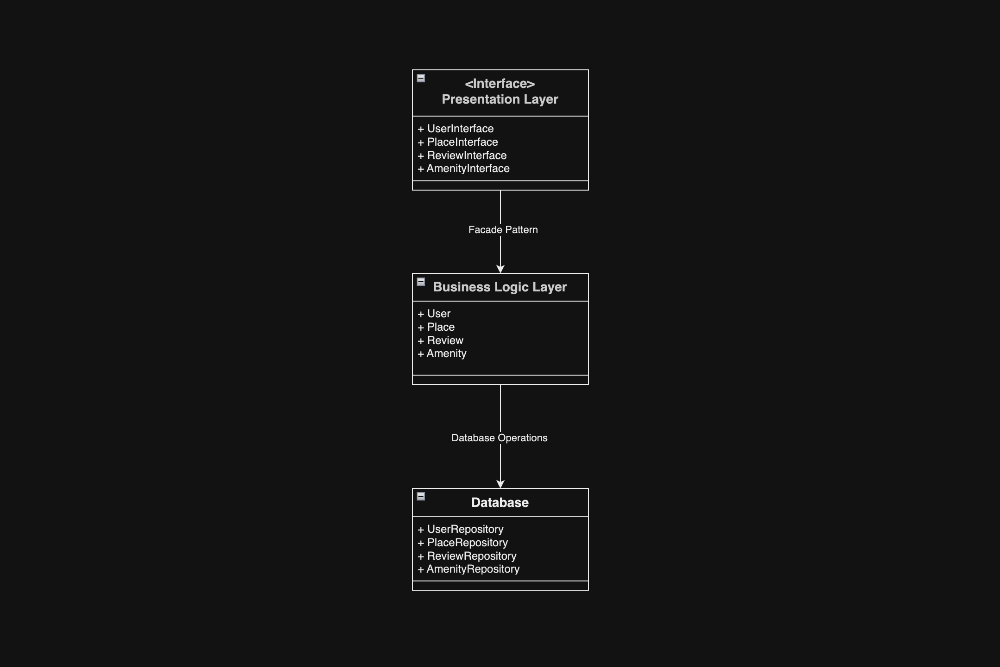
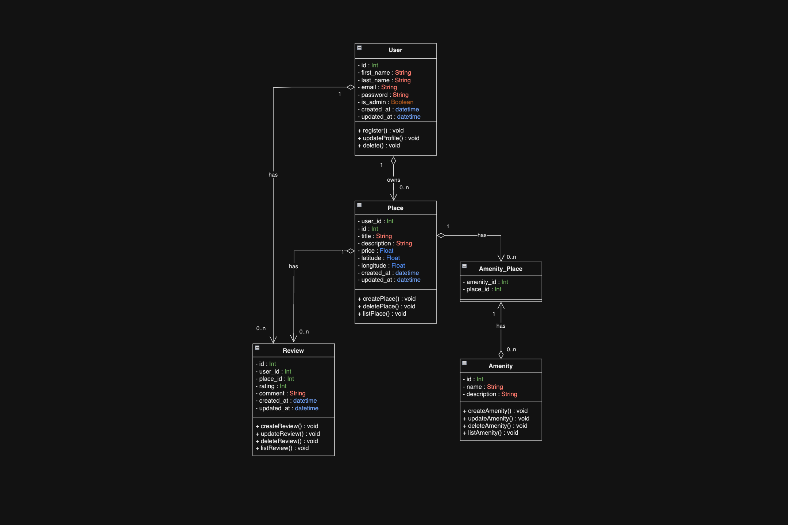
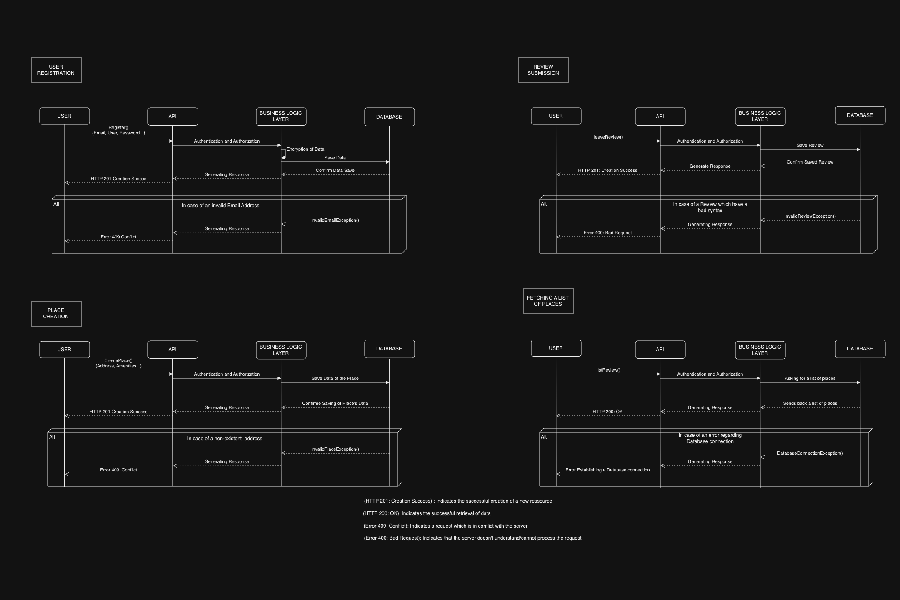

# HBnB - HolbertonBnB Project

**HBnB** is a web-based platform inspired by AirBnB that allows users to register, create place listings, submit reviews, and manage amenities, all while following a modular architecture and best development practices.

## Table of Contents
- [Project Overview](#project-overview)
- [Architecture](#architecture)
  - [Sequence Diagrams](#sequence-diagrams)
  - [Class Diagrams](#class-diagrams)
  - [Layered Architecture](#layered-architecture)
- [Features](#features)
- [Installation](#installation)
- [Usage](#usage)
- [Contributors](#contributors)
- [License](#license)

---

## Project Overview

The **HBnB** application enables users to perform several key operations:
- Manage their user account.
- Create, list, and view place listings.
- Submit reviews for places they've visited.
- Manage amenities associated with places.

The project follows a **layered architecture** divided into three layers: **Presentation**, **Business Logic**, and **Persistence**. It emphasizes security, data validation, and error handling. User, place, and review data are stored in a relational database.

---

## Architecture

### Layered Architecture

The project is built using a **layered architecture**:
1. **Presentation Layer**: User interface through the API.
2. **Business Logic Layer**: Manages the core operations for users, places, reviews, and amenities.
3. **Persistence Layer**: Handles database interactions via repositories like `UserRepository` and `PlaceRepository`.

The **Facade Pattern** simplifies interactions between the Presentation and Business Logic layers.



### Class Diagrams

The main entities in the system are:
- **User**: Handles registration, profile updates, and deletion.
- **Place**: Manages the creation, modification, and deletion of listings.
- **Review**: Allows users to create, update, and list reviews.
- **Amenity**: Manages amenities associated with places.

Each class includes attributes like `id`, `created_at`, and CRUD operations.



### Sequence Diagrams

The application follows a typical web-based architecture:
- The **user** interacts with the **API**, sending requests like `register()`, `createPlace()`, and `leaveReview()`.
- The API authenticates the user and forwards the request to the **Business Logic Layer**.
- The **Business Logic Layer** manages data validation and interacts with the database.
- Typical HTTP responses include:
  - **201**: Successful resource creation.
  - **200**: Successful data retrieval.
  - **409**: Data conflict.
  - **400**: Invalid request.



---

## Features

- **User Registration**: Register with email and password.
- **Profile Management**: Update and delete user profiles.
- **Place Creation**: Create, list, and delete places.
- **Review Submission**: Submit reviews and ratings for places.
- **Amenity Management**: Add and update amenities for places.
- **Error Handling**: Comprehensive error management with specific exceptions.

---

## Installation

To run the **HBnB** project locally:

1. Clone the repository:
   ```bash
   git clone https://github.com/yourusername/hbnb.git
   ```

2. Navigate into the project directory:
   ```
   cd HBnB-UML
   ```

## Contributors
This project is developed by [Nour Chaouch](https://github.com/NChaouch/), [Clement Chassemon](https://github.com/UsagerLambda), and [Florian Bombeeck](https://github.com/Pandor3).


## License
This project is licensed under the MIT license. You are free to use, modify, and distribute it under the terms of the license.
