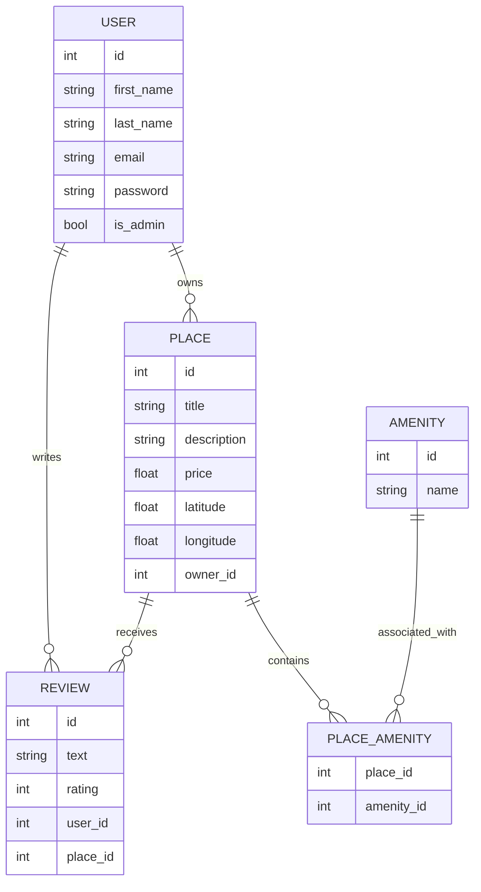

# HBnB (Holberton AirBnB)

## Description

HBnB est une application de type AirBnB, structurée en trois couches (Présentation, Logique Métier et Persistance) pour gérer les utilisateurs, les lieux, les avis et les commodités. Le projet est conçu avec Flask et Flask-RESTx pour créer une API RESTful.

## Structure du Projet

```bash
hbnb/
├── app/
│   ├── __init__.py
│   ├── api/
│   │   ├── __init__.py
│   │   ├── v1/
│   │       ├── __init__.py
│   │       ├── users.py
│   │       ├── places.py
│   │       ├── reviews.py
│   │       ├── amenities.py
│   ├── models/
│   │   ├── __init__.py
│   │   ├── user.py
│   │   ├── place.py
│   │   ├── review.py
│   │   ├── amenity.py
│   ├── services/
│   │   ├── __init__.py
│   │   ├── facade.py
│   ├── persistence/
│       ├── __init__.py
│       ├── repository.py
├── run.py
├── config.py
├── requirements.txt
├── README.md
```

## Installation
### 1. Clone le dépôt:
```bash
git clone https://github.com/ton-utilisateur/hbnb.git
```
### 2. Accède au dossier du projet:
```bash
cd hbnb
```
### 3. Installe les dépendances:
```bash
pip install -r requirements.txt
```

## Utilisation
### Pour démarrer l'application, exécute le fichier **run.py**
```bash
python3 run.py
```

L'application sera accessible à l'adresse http://127.0.0.1:5000.

## Diagrammes




