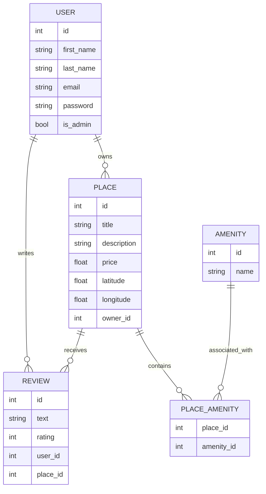
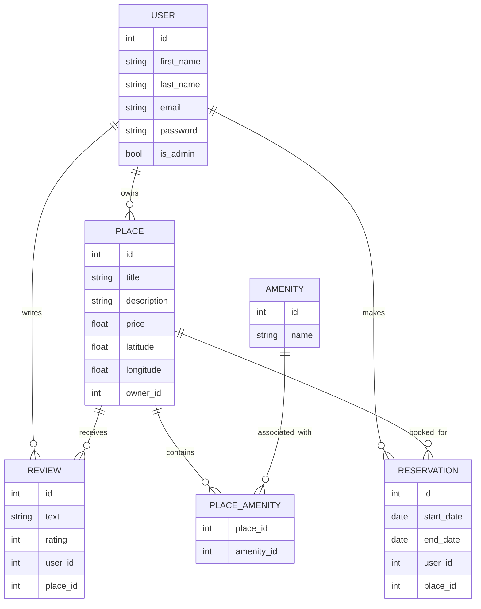

# HBnB (Holberton AirBnB)

## Description

HBnB est une application de type AirBnB, structurée en trois couches (Présentation, Logique Métier et Persistance) pour gérer les utilisateurs, les lieux, les avis et les commodités. Le projet est conçu avec Flask et Flask-RESTx pour créer une API RESTful.

## Structure du Projet

```bash
hbnb/
├── app/
│   ├── __init__.py
│   ├── api/
│   │   ├── __init__.py
│   │   ├── v1/
│   │       ├── __init__.py
│   │       ├── users.py
│   │       ├── places.py
│   │       ├── reviews.py
│   │       ├── amenities.py
│   ├── models/
│   │   ├── __init__.py
│   │   ├── user.py
│   │   ├── place.py
│   │   ├── review.py
│   │   ├── amenity.py
│   ├── services/
│   │   ├── __init__.py
│   │   ├── facade.py
│   ├── persistence/
│       ├── __init__.py
│       ├── repository.py
├── run.py
├── config.py
├── requirements.txt
├── README.md
```

## Installation
### 1. Clone le dépôt:
```bash
git clone https://github.com/ton-utilisateur/hbnb.git
```
### 2. Accède au dossier du projet:
```bash
cd hbnb
```
### 3. Installe les dépendances:
```bash
pip install -r requirements.txt
```

## Utilisation
<span style="color: yellow;">(Une base de données par défaut est déjà prédéfinie, si vous souhaitez simplement tester le code.)</span>.
### Pour créer une nouvelle base de données et exécuter le serveur, lancez le fichier **create_db.sh**
```bash
./create_db.sh
```
### Pour lancer le serveur, exécutez le fichier **run_app.sh**
```bash
./run_app.sh
```

L'application sera accessible à l'adresse http://127.0.0.1:5000.

Vous pouvez accéder à l'interface de l'application en utilisant l'extension VS Code ``Live Server``. Après son installation, cliquez sur son icône en bas à droite de l'écran, puis sélectionnez le fichier ``index.html`` situé dans le dossier ``part4/front_end/``. L'application s'ouvrira ensuite dans votre navigateur.

## Login infos

### User 1
```
first_name: John
last_name: Doe
email: john.doe@mail.com
password: Pass1234
```

### User 2
```
first_name: Alice
last_name: Smith
email: alice.smith@mail.com
password: Alice2024
```

### User 3
```
first_name: Bob
last_name: Johnson
email: bob.johnson@mail.com
password: Secure
```

## Diagrammes



